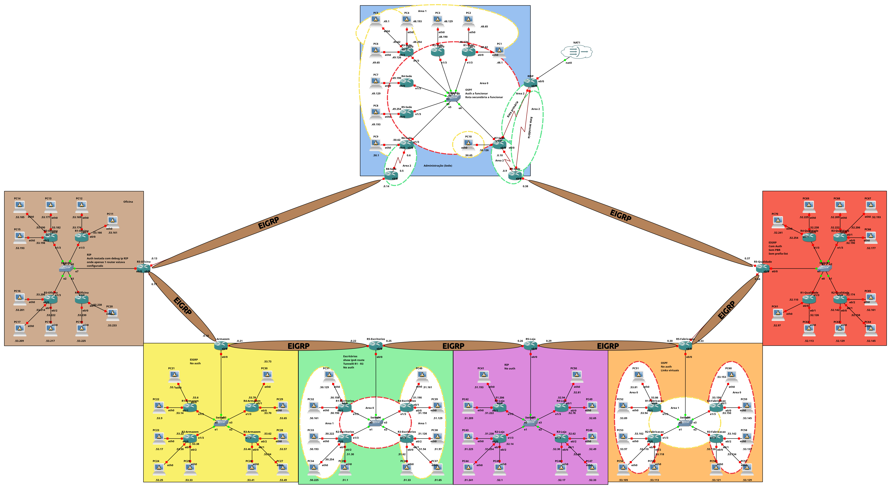

# Distributed-Enterprise-Network

This repository documents the planning, configuration, and simulation of a corporate Wide Area Network (WAN), developed as part of the **Encaminhamento de Dados** (Data Routing) course at the *Instituto Superior de Engenharia de Coimbra (ISEC)*.

---

## Project Overview

The project simulates a realistic enterprise network with a **head office (Administração)** and six **geographically distributed branches**:

- **Escritórios** (Offices)
- **Loja** (Store)
- **Qualidade** (Quality)
- **Armazém** (Warehouse)
- **Fabricação** (Manufacturing)
- **Oficina** (Workshop)

The network was designed using:
- **IPv4 and IPv6 addressing**
- **Dynamic routing protocols**: OSPF, EIGRP, RIP v2
- **Route summarisation**
- **Tunnelling (IPv6 transition)**
- **Redundant internet connectivity with failover**
- **Remote access via Telnet**
- ...

---

## Network Topology

The logical topology ensures centralisation through the head office and uses EIGRP as the backbone protocol between all sites. Each branch also implements its own interior routing protocol, as per project requirements.
<div align="center">
  
</div>

---

## Address Plan Summary

The base network allocated by the ISP is **194.65.48.0/21**, totalling 2,048 addresses.

| Location       | Subnet Mask | Subnets | Hosts/Subnet | Total Hosts | Address Range                     |
|----------------|-------------|---------|--------------|-------------|-----------------------------------|
| Administration | /26         | 10      | 62           | 620         | 194.65.48.0 – 194.65.50.127       |
| Offices        | /27         | 10      | 30           | 300         | 194.65.50.128 – 194.65.51.191     |
| Store          | /28         | 10      | 14           | 140         | 194.65.51.192 – 194.65.52.95      |
| Quality        | /28         | 10      | 14           | 140         | 194.65.52.96 – 194.65.52.255      |
| Warehouse      | /29         | 10      | 6            | 60          | 194.65.53.0 – 194.65.53.79        |
| Manufacturing  | /29         | 10      | 6            | 60          | 194.65.53.80 – 194.65.53.159      |
| Workshop       | /29         | 10      | 6            | 60          | 194.65.53.160 – 194.65.53.239     |
| **Total Used** |             | 70      |              | **1,380**   |                                   |

> **528 addresses remain available for future expansion.**

---

## Base Router Configuration

All routers share a baseline setup for standardisation and remote access.

```bash
enable
configure terminal
hostname <ROUTER_NAME>
banner motd # Welcome to router <ROUTER_NAME> #
service password-encryption

line vty 0 0
 password cisco
 login
 transport input telnet
 exec-timeout 10

enable secret cisco
